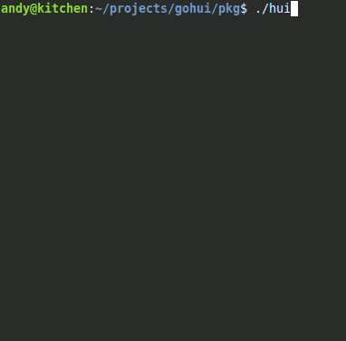

```
j6      j6
QQ      4P
QQ
QQ
QQQQQ6  jg
QQQQQQ  QQ
QQ  QQ  QQ
QQ  QQ  QQ
QQ  QQQQQQ
4P  4QQQQP
```

# What is this?

A customizable terminal user-interface for common tasks and personal tastes.  
In a config file, you can create menus and commands within and then deploy it to
a user.  
Then set hui as their default shell, to chain them into specific tasks :D  
or just install it for yourself by having the configs within your home
directory.  



# Install

By default, the following steps will install two binaries "hui" and "courier".  
Courier is the pager that also lives here, because they share a lot of code so
they can look and feel similar.  
If you don't wish to have "courier", edit
[cfg_install.sh](https://github.com/SchokiCoder/gohui/blob/main/cfg_install.sh).  

Follow these steps:  

- `git clone https://github.com/SchokiCoder/gohui`
- `cd gohui`
- _optionally: check out cfg_install.sh_
- `chmod u+x *.sh`
- `sudo ./install.sh` (`sudo` or `doas` may needed)

# Contributing

If you wish to do that, follow these steps to make it convenient for everyone:  

- have a look at docs/todo.md to see short term goals
- create a fork on GitHub
- commit your changes
- create a pull request on GitHub

Thank you and have fun.  

# Origins

This project is a Go language rewrite of
[the original and now obsolete hui](https://github.com/SchokiCoder/hui).  
This will reimplement all of the original features plus a config file system,
so you don't have to recompile the source every time you want to change the
config.  
Some minor implementation details may vary, hopefully for the better.  
